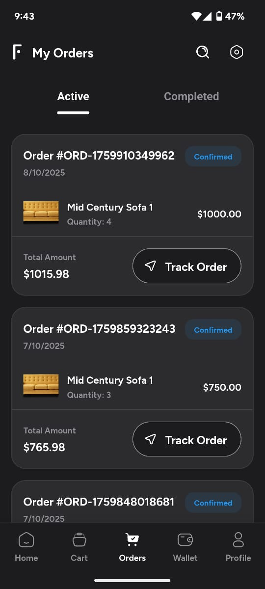
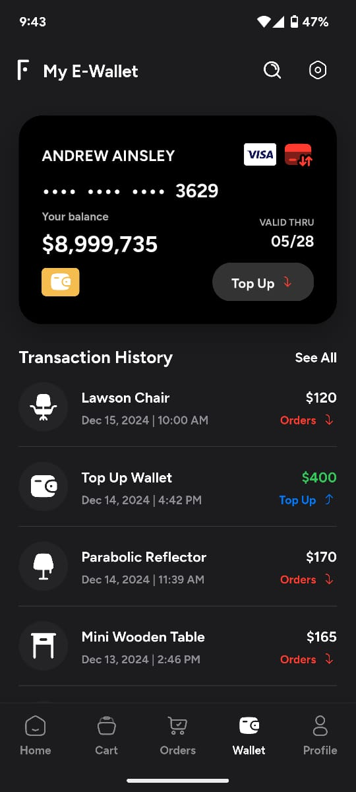
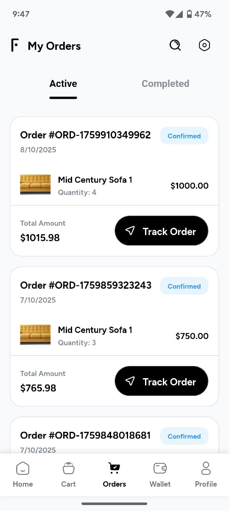

# 🪑 Funica — Smart Modern Furniture App (Flutter)
---

## ✨ Overview

**Funica** is a **modern, smart, and fully responsive furniture shopping app** built entirely using **Flutter**.  
It allows users to browse, customize, and purchase elegant furniture pieces from the comfort of their home — all within a seamless, beautifully designed app that works on both **Android** and **iOS** devices.

---

## 🧭 Features

- 🛋️ Smart furniture browsing & product categories  
- 💳 Built-in wallet for easy top-ups and transactions  
- 🛒 Cart and order tracking system  
- 🌗 Light & dark mode support  
- 🚀 Optimized for high performance  
- ⚙️ GetX for smooth and reactive navigation  
- 🎨 100% Flutter — single codebase for both platforms  

---

## ⚙️ Tech Stack

| Component | Technology |
|------------|-------------|
| **Framework** | Flutter (Dart) |
| **State Management** | GetX |
| **UI Toolkit** | Custom reusable widgets |
| **Design Language** | Material 3 + Modern Layouts |
| **Backend (Optional)** | Firebase / REST APIs |
| **Supported Platforms** | Android & iOS |

---
## 🖼️ App Screenshots

Here’s a quick look at **Funica’s modern and elegant design**:

| Home Screen | Product Details | Wallet & Transactions |
|--------------|----------------|-----------------------|
|  |  |  |
|  |  |  |

## 🚀 Quick Start Guide

### 1️⃣ Clone the Repository
```bash
git clone https://github.com/ehsanyaqoob/funica.git
cd funica
```
### 2️⃣ Install Dependencies
```bash
flutter pub get
```
### 3️⃣ Run the App (Android or iOS)
```bash
flutter run
```
### 🍎 For macOS / iPhone Users
Install Flutter SDK
```bash
mkdir -p ~/development
cd ~/development
git clone https://github.com/flutter/flutter.git -b stable
export PATH="$PATH:~/development/flutter/bin"
echo 'export PATH="$PATH:~/development/flutter/bin"' >> ~/.zshrc
source ~/.zshrc
flutter doctor
```
### Install CocoaPods (for iOS dependencies)
```bash
brew install cocoapods
cd ios
pod install
cd ..
```
### Open in Xcode (for signing)
```bash
bopen ios/Runner.xcworkspace
```
Then in Xcode:
Set Bundle Identifier (e.g., com.yourname.funica)
Choose your Team
Enable Automatically manage signing

### Run on IPhone
```bash
flutter devices
flutter run
```


### 🤖 For Windows / Android Users
Install Flutter SDK
```bash
git clone https://github.com/flutter/flutter.git -b stable
setx PATH "%PATH%;C:\src\flutter\bin"
flutter doctor
```
### Connect Device or Start Emulator
```bash
flutter devices
flutter run
```
### 🧰 Helpful Flutter Commands
```bash
flutter doctor -v                 # Check Flutter environment
flutter pub get                   # Install project dependencies
flutter clean                     # Clear cache
cd ios && pod install && cd ..    # Install iOS pods
flutter run                       # Run on device/emulator
flutter build apk --release       # Build Android release APK
flutter build ipa                 # Build iOS IPA
```
🌍 How the Public Can Use Funica
Once available on App Store and Google Play Store, users can:
Browse furniture collections by category
View product details, including materials and pricing
Add to cart or wishlist for later purchase
Top-up wallet for smooth, secure payments
Track orders and deliveries directly in the app
Funica is built to make furnishing your home smarter, easier, and more beautiful.

📬 Contact

👨‍💻 Developer: Ehsan Yaqoob
📧 Email: ehsanyaqoob07@gmail.com

📱 Project: Funica — Smart Modern Furniture App
💙 Built With: Flutter
